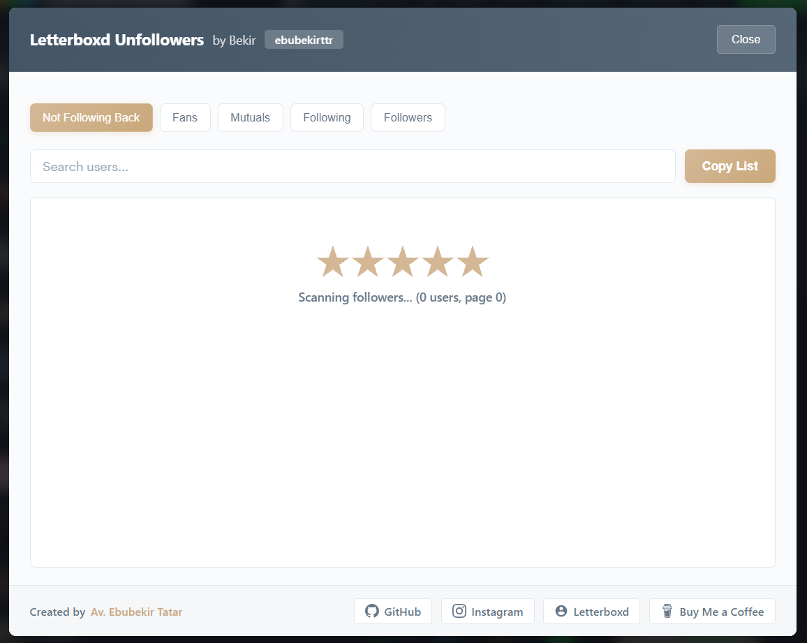

# 🎬 Letterboxd Unfollowers

[](https://buymeacoffee.com/ebubekirtatar)

[](https://github.com/ebubekirttr/LetterboxdUnfollowers)
[](https://letterboxd.com/ebubekirttr/)
[](https://creativecommons.org/licenses/by-nc-sa/4.0/)

> A powerful browser script to track who's not following you back on Letterboxd. Find your unfollowers, fans, and mutuals with a beautiful, modern interface.

[🇹🇷 Türkçe](README.tr.md) | **🇬🇧 English**

---

## ✨ Features

- 🔍 **Find Unfollowers** - See who you follow but doesn't follow you back
- 💝 **Discover Fans** - Find people who follow you but you don't follow back
- 🤝 **View Mutuals** - See all your mutual connections
- 📊 **Complete Statistics** - Get detailed stats about your followers and following
- 🔎 **Real-time Search** - Filter users instantly as you type
- 📋 **Copy to Clipboard** - Export usernames with one click
- 🎨 **Beautiful UI** - Modern, responsive design with smooth animations
- 🌍 **Multi-language Support** - 13 languages supported with a premium flag dropdown menu (EN, TR, AR, ZH, JA, ES, PT, FA, RU, HI, FR, DE, IT)
- ⚡ **Fast & Efficient** - Optimized performance with progress tracking

---

## 📸 Screenshots

<div align="center">

### Main Interface


### User Statistics


</div>

---

## 🚀 How to Use

### Step 1: Navigate to Your Letterboxd Profile

Go to one of these pages on Letterboxd:
- Your profile: `https://letterboxd.com/{username}/`
- Your following list: `https://letterboxd.com/{username}/following/`
- Your followers list: `https://letterboxd.com/{username}/followers/`

Replace `{username}` with your actual Letterboxd username.

### Step 2: Open Browser Console

**Chrome / Edge / Brave:**
- Press `F12` or `Ctrl + Shift + J` (Windows/Linux)
- Press `Cmd + Option + J` (Mac)

**Firefox:**
- Press `F12` or `Ctrl + Shift + K` (Windows/Linux)
- Press `Cmd + Option + K` (Mac)

**Safari:**
- Enable Developer Menu: Preferences → Advanced → Show Develop menu
- Press `Cmd + Option + C`

### Step 3: Copy & Paste the Script

Copy the entire code below and paste it into the console, then press `Enter`:

```javascript
(()=>{if(window._lbuRunning)return void console.warn("LetterboxdUnfollowers already running");window._lbuRunning=!0;const n=location.pathname.split("/").filter(Boolean)[0];if(!n)return alert("Username not found in URL"),void(window._lbuRunning=!1);const e={en:{n:"EN",f:"🇺🇸",t:"Letterboxd Unfollowers",b:"by Bekir",c:"Close",fg:"Following",fr:"Followers",nf:"Not Following Back",fs:"Fans",ms:"Mutuals",s:"Search users...",cp:"Copy List",cd:"Copied!",nu:"No users to show",sc:"Scanning followers & following...",cb:"Created by",sf:"Scanning following...",sr:"Scanning followers...",sp:"({count} users, page {page})",er:"Error while scanning. Check console.",ce:"No users to copy"},tr:{n:"TR",f:"🇹🇷",t:"Letterboxd Unfollowers",b:"Bekir tarafından",c:"Kapat",fg:"Takip",fr:"Takipçi",nf:"Geri Takip Etmeyenler",fs:"Hayranlar",ms:"Karşılıklı",s:"Kullanıcı ara...",cp:"Listeyi Kopyala",cd:"Kopyalandı!",nu:"Gösterilecek kullanıcı yok",sc:"Takipçiler ve takip edilenler taranıyor...",cb:"Hazırlayan",sf:"Takip edilenler taranıyor...",sr:"Takipçiler taranıyor...",sp:"({count} kullanıcı, sayfa {page})",er:"Tarama sırasında hata oluştu. Konsolu kontrol edin.",ce:"Kopyalanacak kullanıcı yok"},ar:{n:"AR",f:"🇸🇦",t:"Letterboxd Unfollowers",b:"بواسطة بكير",c:"إغلاق",fg:"يتابع",fr:"متابعون",nf:"لا يتابعك بالمثل",fs:"معجبون",ms:"تبادلي",s:"البحث عن مستخدمين...",cp:"نسخ القائمة",cd:"تم النسخ!",nu:"لا يوجد مستخدمون",sc:"جاري فحص المتابعين والمتابعات...",cb:"أنشئت بواسطة",sf:"جاري فحص المتابعات...",sr:"جاري فحص المتابعين...",sp:"({count} مستخدم، صفحة {page})",er:"حدث خطأ أثناء الفحص. تحقق من وحدة التحكم.",ce:"لا يوجد مستخدمون للنسخ"},zh:{n:"ZH",f:"🇨🇳",t:"Letterboxd Unfollowers",b:"由 Bekir 开发",c:"关闭",fg:"正在关注",fr:"粉丝",nf:"未回关",fs:"追随者",ms:"互关",s:"搜索用户...",cp:"复制列表",cd:"已复制!",nu:"没有可显示的用户",sc:"正在扫描粉丝和关注...",cb:"作者",sf:"正在扫描关注...",sr:"正在扫描粉丝...",sp:"({count} 用户, 第 {page} 页)",er:"扫描时出错。请检查控制台。",ce:"没有可复制的用户"},ja:{n:"JA",f:"🇯🇵",t:"Letterboxd Unfollowers",b:"Bekir による",c:"閉じる",fg:"フォロー中",fr:"フォロワー",nf:"フォローバックされていない",fs:"ファン",ms:"相互フォロー",s:"ユーザーを検索...",cp:"リストをコピー",cd:"コピーしました!",nu:"表示するユーザーがいません",sc:"フォローとフォロワーをスキャン中...",cb:"制作",sf:"フォロー中をスキャン中...",sr:"フォロワーをスキャン中...",sp:"({count} ユーザー, {page} ページ目)",er:"スキャン中にエラーが発生しました。コンソールを確認してください。",ce:"コピーするユーザーがいません"},es:{n:"ES",f:"🇪🇸",t:"Letterboxd Unfollowers",b:"por Bekir",c:"Cerrar",fg:"Siguiendo",fr:"Seguidores",nf:"No te siguen de vuelta",fs:"Fans",ms:"Mutuos",s:"Buscar usuarios...",cp:"Copiar lista",cd:"¡Copiado!",nu:"No hay usuarios para mostrar",sc:"Escaneando seguidores y seguidos...",cb:"Creado por",sf:"Escaneando seguidos...",sr:"Escaneando seguidores...",sp:"({count} usuarios, página {page})",er:"Error al escanear. Revisa la consola.",ce:"No hay usuarios para copiar"},pt:{n:"PT",f:"🇧🇷",t:"Letterboxd Unfollowers",b:"por Bekir",c:"Fechar",fg:"Seguindo",fr:"Seguidores",nf:"Não seguem de volta",fs:"Fãs",ms:"Mútuos",s:"Buscar usuários...",cp:"Copiar lista",cd:"Copiado!",nu:"Nenhum usuário para mostrar",sc:"Escaneando seguidores e seguindo...",cb:"Criado por",sf:"Escaneando seguindo...",sr:"Escaneando seguidores...",sp:"({count} usuários, página {page})",er:"Erro ao escanear. Verifique o console.",ce:"Nenhum usuário para copiar"},fa:{n:"FA",f:"🇮🇷",t:"Letterboxd Unfollowers",b:"توسط بکیر",c:"بستن",fg:"دنبال شده‌ها",fr:"دنبال‌کنندگان",nf:"دنبال نکرده است",fs:"طرفداران",ms:"متقابل",s:"جستجوی کاربران...",cp:"کپی لیست",cd:"کپی شد!",nu:"کاربری برای نمایش وجود ندارد",sc:"در حال اسکن فالوورها و فالوینگ‌ها...",cb:"ساخته شده توسط",sf:"در حال اسکن فالوینگ‌ها...",sr:"در حال اسکن فالوورها...",sp:"({count} کاربر، صفحه {page})",er:"خطا در هنگام اسکن. کنسول را چک کنید.",ce:"کاربری برای کپی وجود ندارد"},ru:{n:"RU",f:"🇷🇺",t:"Letterboxd Unfollowers",b:"от Bekir",c:"Закрыть",fg:"Подписки",fr:"Подписчики",nf:"Не подписаны в ответ",fs:"Фанаты",ms:"Взаимно",s:"Поиск пользователей...",cp:"Копировать список",cd:"Скопировано!",nu:"Нет пользователей для отображения",sc:"Сканирование подписчиков и подписок...",cb:"Создано",sf:"Сканирование подписок...",sr:"Сканирование подписчиков...",sp:"({count} польz., стр. {page})",er:"Ошибка при сканировании. Проверьте консоль.",ce:"Нет пользователей для копирования"},hi:{n:"HI",f:"🇮🇳",t:"Letterboxd Unfollowers",b:"Bekir द्वारा",c:"बंद करें",fg:"फॉलो कर रहे हैं",fr:"फॉलोअर्स",nf:"वापस फॉलो नहीं किया",fs:"प्रशंसक",ms:"आपसी",s:"उपयोगकर्ताओं को खोजें...",cp:"सूची कॉपी करें",cd:"कॉपी हो गया!",nu:"दिखाने के लिए कोई उपयोगकर्ता नहीं",sc:"फॉलोअर्स और Following को स्कैन किया जा रहा है...",cb:"द्वारा निर्मित",sf:"Following स्कैन किया जा रहा है...",sr:"फॉलोअर्स स्कैन किया जा रहा है...",sp:"({count} उपयोगकर्ता, पृष्ठ {page})",er:"स्कैन करते समय त्रुटि हुई। कंसोल की जाँच करें।",ce:"कॉपी करने के लिए कोई उपयोगकर्ता नहीं"},fr:{n:"FR",f:"🇫🇷",t:"Letterboxd Unfollowers",b:"par Bekir",c:"Fermer",fg:"Abonnements",fr:"Abonnés",nf:"Ne vous suit pas en retour",fs:"Fans",ms:"Mutuels",s:"Rechercher des utilisateurs...",cp:"Copier la liste",cd:"Copié!",nu:"Aucun utilisateur à afficher",sc:"Analyse des abonnés et abonnements...",cb:"Créé par",sf:"Analyse des abonnements...",sr:"Analyse des abonnés...",sp:"({count} utilisateurs, page {page})",er:"Erreur lors de l'analyse. Vérifiez la console.",ce:"Aucun utilisateur à copier"},de:{n:"DE",f:"🇩🇪",t:"Letterboxd Unfollowers",b:"von Bekir",c:"Schließen",fg:"Folge ich",fr:"Follower",nf:"Folgt nicht zurück",fs:"Fans",ms:"Gegenseitig",s:"Benutzer suchen...",cp:"Liste kopieren",cd:"Kopiert!",nu:"Keine Benutzer anzuzeigen",sc:"Follower & Following werden gescannt...",cb:"Erstellt von",sf:"Following wird gescannt...",sr:"Follower wird gescannt...",sp:"({count} Benutzer, Seite {page})",er:"Fehler beim Scannen. Konsole prüfen.",ce:"Keine Benutzer zum Kopieren"},it:{n:"IT",f:"🇮🇹",t:"Letterboxd Unfollowers",b:"da Bekir",c:"Chiudi",fg:"Seguiti",fr:"Follower",nf:"Non ti segue a sua volta",fs:"Fan",ms:"Reciproci",s:"Cerca utenti...",cp:"Copia lista",cd:"Copiato!",nu:"Nessun utente da mostrare",sc:"Scansione follower e seguiti...",cb:"Creato da",sf:"Scansione seguiti...",sr:"Scansione follower...",sp:"({count} utenti, pagina {page})",er:"Errore durante la scansione. Controlla la console.",ce:"Nessun utente da copiare"}};let a=e[navigator.language.split("-")[0]]||e.en;const r=document.createElement("style");r.textContent='\n    @keyframes fadeIn { from { opacity: 0; transform: scale(0.96); } to { opacity: 1; transform: scale(1); } }\n    @keyframes slideUp { from { opacity: 0; transform: translateY(10px); } to { opacity: 1; transform: translateY(0); } }\n    @keyframes l20 { 90%, 100% { background-size: 100% 100%; } }\n    \n    .lbu-overlay {\n      position: fixed;\n      inset: 0;\n      z-index: 99999;\n      background: rgba(14, 18, 24, 0.75);\n      backdrop-filter: blur(8px);\n      display: flex;\n      align-items: center;\n      justify-content: center;\n      animation: fadeIn 0.25s ease-out;\n      font-family: -apple-system, BlinkMacSystemFont, "Segoe UI", Roboto, sans-serif;\n    }\n    \n    .lbu-card {\n      width: min(1050px, 94vw);\n      height: min(720px, 90vh);\n      background: #fff;\n      border-radius: 8px;\n      box-shadow: 0 20px 60px rgba(0, 0, 0, 0.3);\n      display: flex;\n      flex-direction: column;\n      overflow: hidden;\n      animation: slideUp 0.3s ease-out;\n    }\n    \n    .lbu-header {\n      background: linear-gradient(to right, #445566, #556677);\n      padding: 20px 24px;\n      display: flex;\n      align-items: center;\n      justify-content: space-between;\n      border-bottom: 1px solid rgba(255, 255, 255, 0.1);\n    }\n    \n    .lbu-title {\n      font-size: 18px;\n      font-weight: 600;\n      color: #fff;\n      display: flex;\n      align-items: center;\n      gap: 10px;\n    }\n    \n    .lbu-title-main {\n      font-weight: 700;\n    }\n    \n    .lbu-title-by {\n      font-weight: 400;\n      opacity: 0.8;\n      font-size: 14px;\n    }\n    \n    .lbu-pill {\n      background: rgba(255, 255, 255, 0.2);\n      color: #fff;\n      padding: 4px 12px;\n      border-radius: 4px;\n      font-weight: 600;\n      font-size: 13px;\n      backdrop-filter: blur(10px);\n    }\n    \n    .lbu-close {\n      background: rgba(255, 255, 255, 0.15);\n      backdrop-filter: blur(10px);\n      border: 1px solid rgba(255, 255, 255, 0.2);\n      color: #fff;\n      border-radius: 4px;\n      padding: 8px 16px;\n      cursor: pointer;\n      transition: all 0.2s ease;\n      font-weight: 500;\n      font-size: 13px;\n    }\n    \n    .lbu-close:hover {\n      background: rgba(255, 255, 255, 0.25);\n    }\n    \n    .lbu-body {\n      display: flex;\n      flex-direction: column;\n      gap: 16px;\n      padding: 20px 24px;\n      overflow: hidden;\n      flex: 1;\n      background: #fafbfc;\n    }\n    \n    .lbu-stats {\n      display: grid;\n      grid-template-columns: repeat(auto-fit, minmax(140px, 1fr));\n      gap: 12px;\n    }\n    \n    .lbu-stat {\n      background: #fff;\n      border: 1px solid #e1e8ed;\n      border-radius: 6px;\n      padding: 14px 16px;\n      transition: all 0.2s ease;\n    }\n    \n    .lbu-stat:hover {\n      border-color: #d4b896;\n      box-shadow: 0 2px 8px rgba(212, 184, 150, 0.15);\n    }\n    \n    .lbu-stat .label {\n      color: #8899aa;\n      font-size: 11px;\n      font-weight: 600;\n      margin-bottom: 4px;\n      text-transform: uppercase;\n      letter-spacing: 0.5px;\n      white-space: nowrap;\n      overflow: hidden;\n      text-overflow: ellipsis;\n    }\n    \n    .lbu-stat .value {\n      font-size: 24px;\n      font-weight: 700;\n      color: #2c3e50;\n    }\n    \n    .lbu-lang-dropdown {\n      position: relative;\n      margin-left: 10px;\n    }\n\n    .lbu-lang-current {\n      background: rgba(255, 255, 255, 0.1);\n      border: 1px solid rgba(255, 255, 255, 0.2);\n      color: #fff;\n      font-size: 13px;\n      font-weight: 600;\n      padding: 4px 10px;\n      border-radius: 4px;\n      cursor: pointer;\n      display: flex;\n      align-items: center;\n      gap: 6px;\n      transition: all 0.2s ease;\n    }\n\n    .lbu-lang-current:hover {\n      background: rgba(255, 255, 255, 0.2);\n    }\n\n    .lbu-lang-current svg {\n      width: 10px;\n      height: 10px;\n      fill: currentColor;\n      opacity: 0.8;\n      transition: transform 0.2s ease;\n    }\n\n    .lbu-lang-dropdown.open .lbu-lang-current svg {\n      transform: rotate(180deg);\n    }\n\n    .lbu-lang-menu {\n      position: absolute;\n      top: calc(100% + 5px);\n      right: 0;\n      background: #fff;\n      border: 1px solid #e1e8ed;\n      border-radius: 6px;\n      box-shadow: 0 4px 12px rgba(0, 0, 0, 0.15);\n      z-index: 10000;\n      display: none;\n      width: 160px;\n      max-height: 250px;\n      overflow-y: auto;\n      padding: 4px 0;\n    }\n\n    .lbu-lang-menu.visible {\n      display: block;\n    }\n\n    .lbu-lang-item {\n      padding: 8px 12px;\n      font-size: 13px;\n      color: #2c3e50;\n      cursor: pointer;\n      display: flex;\n      align-items: center;\n      gap: 8px;\n      transition: background 0.2s ease;\n    }\n\n    .lbu-lang-item:hover {\n      background: #f5f7f9;\n    }\n\n    .lbu-lang-item.active {\n      color: #c9a87a;\n      font-weight: 700;\n      background: #fefaf5;\n    }\n    \n    .lbu-tabs {\n      display: flex;\n      gap: 8px;\n      flex-wrap: wrap;\n      padding-bottom: 4px;\n    }\n    \n    .lbu-tab {\n      border: 1px solid #e1e8ed;\n      background: #fff;\n      color: #667788;\n      border-radius: 6px;\n      padding: 8px 14px;\n      cursor: pointer;\n      transition: all 0.2s ease;\n      font-weight: 500;\n      font-size: 13px;\n    }\n    \n    .lbu-tab:hover:not(.active) {\n      border-color: #d4b896;\n      background: #fafbfc;\n    }\n    \n    .lbu-tab.active {\n      background: linear-gradient(135deg, #d4b896, #c9a87a);\n      color: #fff;\n      border-color: #d4b896;\n      box-shadow: 0 2px 8px rgba(212, 184, 150, 0.3);\n    }\n    \n    .lbu-controls {\n      display: flex;\n      gap: 10px;\n      align-items: stretch;\n    }\n    \n    .lbu-search {\n      flex: 1;\n      background: #fff;\n      border: 1px solid #e1e8ed;\n      color: #2c3e50;\n      border-radius: 6px;\n      padding: 10px 14px;\n      font-size: 14px;\n      transition: all 0.2s ease;\n    }\n    \n    .lbu-search:focus {\n      outline: none;\n      border-color: #d4b896;\n      box-shadow: 0 0 0 3px rgba(212, 184, 150, 0.1);\n    }\n    \n    .lbu-search::placeholder {\n      color: #99aabb;\n    }\n    \n    .lbu-btn {\n      background: linear-gradient(135deg, #d4b896, #c9a87a);\n      border: none;\n      color: #fff;\n      padding: 10px 20px;\n      border-radius: 6px;\n      cursor: pointer;\n      font-weight: 600;\n      font-size: 14px;\n      transition: all 0.2s ease;\n      box-shadow: 0 2px 6px rgba(212, 184, 150, 0.25);\n    }\n    \n    .lbu-btn:hover {\n      transform: translateY(-1px);\n      box-shadow: 0 4px 12px rgba(212, 184, 150, 0.35);\n    }\n    \n    .lbu-btn:active {\n      transform: translateY(0);\n    }\n    \n    .lbu-list {\n      overflow: auto;\n      background: #fff;\n      border: 1px solid #e1e8ed;\n      border-radius: 6px;\n      padding: 14px;\n      display: grid;\n      grid-template-columns: repeat(auto-fill, minmax(260px, 1fr));\n      gap: 12px;\n      flex: 1;\n    }\n    \n    .lbu-list::-webkit-scrollbar {\n      width: 10px;\n    }\n    \n    .lbu-list::-webkit-scrollbar-track {\n      background: #f5f5f5;\n      border-radius: 5px;\n    }\n    \n    .lbu-list::-webkit-scrollbar-thumb {\n      background: linear-gradient(135deg, #d4b896, #c9a87a);\n      border-radius: 5px;\n    }\n    \n    .lbu-list::-webkit-scrollbar-thumb:hover {\n      background: linear-gradient(135deg, #c9a87a, #be9d6f);\n    }\n    \n    .lbu-item {\n      background: #fafbfc;\n      border: 1px solid #e1e8ed;\n      border-radius: 6px;\n      padding: 12px;\n      display: flex;\n      gap: 12px;\n      align-items: center;\n      transition: all 0.2s ease;\n    }\n    \n    .lbu-item:hover {\n      border-color: #d4b896;\n      box-shadow: 0 2px 8px rgba(212, 184, 150, 0.15);\n      transform: translateY(-1px);\n    }\n    \n    .lbu-avatar {\n      width: 48px;\n      height: 48px;\n      border-radius: 4px;\n      border: 2px solid #e1e8ed;\n      flex-shrink: 0;\n      object-fit: cover;\n      transition: all 0.2s ease;\n    }\n    \n    .lbu-item:hover .lbu-avatar {\n      border-color: #d4b896;\n    }\n    \n    .lbu-info {\n      flex: 1;\n      min-width: 0;\n    }\n    \n    .lbu-username {\n      color: #2c3e50;\n      text-decoration: none;\n      font-weight: 600;\n      font-size: 14px;\n      display: block;\n      margin-bottom: 4px;\n      white-space: nowrap;\n      overflow: hidden;\n      text-overflow: ellipsis;\n      transition: all 0.2s ease;\n    }\n    \n    .lbu-username:hover {\n      color: #c9a87a;\n    }\n    \n    .lbu-meta {\n      color: #8899aa;\n      font-size: 12px;\n      display: flex;\n      gap: 8px;\n      flex-wrap: wrap;\n      font-weight: 500;\n    }\n    \n    .lbu-meta-item {\n      display: flex;\n      align-items: center;\n      gap: 4px;\n    }\n    \n    .lbu-icon-sm {\n      width: 12px;\n      height: 12px;\n      opacity: 0.7;\n    }\n    \n    .lbu-empty {\n      color: #8899aa;\n      padding: 40px 20px;\n      text-align: center;\n      font-size: 14px;\n      font-weight: 500;\n      grid-column: 1 / -1;\n    }\n    \n    .lbu-spinner {\n      padding: 40px 20px;\n      text-align: center;\n      color: #667788;\n      font-size: 14px;\n      font-weight: 500;\n      grid-column: 1 / -1;\n      display: flex;\n      flex-direction: column;\n      align-items: center;\n      gap: 16px;\n    }\n    \n    .loader {\n      --s: 40px;\n      height: calc(var(--s)*0.9);\n      width: calc(var(--s)*5);\n      --v1: transparent, #d4b896 0.5deg 108deg, #0000 109deg;\n      --v2: transparent, #d4b896 0.5deg  36deg, #0000  37deg;\n      -webkit-mask:\n        conic-gradient(from 54deg  at calc(var(--s)*0.68) calc(var(--s)*0.57), var(--v1)),\n        conic-gradient(from 90deg  at calc(var(--s)*0.02) calc(var(--s)*0.35), var(--v2)),\n        conic-gradient(from 126deg at calc(var(--s)*0.5)  calc(var(--s)*0.7) , var(--v1)),\n        conic-gradient(from 162deg at calc(var(--s)*0.5)  0                  , var(--v2));\n      -webkit-mask-size: var(--s) var(--s);\n      -webkit-mask-composite: xor, destination-over;\n      mask-composite: exclude, add;\n      -webkit-mask-repeat: repeat-x;\n      background: linear-gradient(#d4b896 0 0) left/0% 100% #e1e8ed no-repeat;\n      animation: l20 2s infinite linear;\n    }\n    \n    .lbu-footer {\n      background: #f5f7f9;\n      border-top: 1px solid #e1e8ed;\n      padding: 14px 24px;\n      display: flex;\n      justify-content: space-between;\n      align-items: center;\n      flex-wrap: wrap;\n      gap: 12px;\n    }\n    \n    .lbu-footer-creator {\n      color: #667788;\n      font-size: 13px;\n      font-weight: 500;\n      display: flex;\n      align-items: center;\n      gap: 6px;\n    }\n    \n    .lbu-footer-creator a {\n      color: #c9a87a;\n      text-decoration: none;\n      font-weight: 600;\n      transition: all 0.2s ease;\n    }\n    \n    .lbu-footer-creator a:hover {\n      color: #be9d6f;\n    }\n    \n    .lbu-footer-links {\n      display: flex;\n      gap: 10px;\n      align-items: center;\n    }\n    \n    .lbu-footer-link {\n      color: #667788;\n      text-decoration: none;\n      font-weight: 500;\n      font-size: 13px;\n      padding: 6px 12px;\n      border-radius: 4px;\n      background: #fff;\n      border: 1px solid #e1e8ed;\n      transition: all 0.2s ease;\n      display: inline-flex;\n      align-items: center;\n      gap: 6px;\n    }\n    \n    .lbu-footer-link:hover {\n      background: #fafbfc;\n      border-color: #d4b896;\n      color: #c9a87a;\n    }\n    \n    .lbu-icon {\n      width: 16px;\n      height: 16px;\n      fill: currentColor;\n    }\n  ',document.head.appendChild(r);const o=document.createElement("div");o.className="lbu-overlay",o.innerHTML=`\n    <div class="lbu-card">\n      <div class="lbu-header">\n        <div class="lbu-title">\n          <span class="lbu-title-main">${a.t}</span>\n          <span class="lbu-title-by">${a.b}</span>\n          <span class="lbu-pill">${n}</span>\n          <div class="lbu-lang-dropdown" id="lbu-lang-dropdown">\n            <div class="lbu-lang-current" id="lbu-lang-current">\n              <span>${a.f}</span>\n              <span>${a.n}</span>\n              <svg viewBox="0 0 24 24"><path d="M7 10l5 5 5-5z"/></svg>\n            </div>\n            <div class="lbu-lang-menu" id="lbu-lang-menu"></div>\n          </div>\n        </div>\n        <button class="lbu-close">${a.c}</button>\n      </div>\n      <div class="lbu-body">\n        <div class="lbu-stats" id="lbu-stats"></div>\n        <div class="lbu-tabs" id="lbu-tabs"></div>\n        <div class="lbu-controls">\n          <input class="lbu-search" id="lbu-search" placeholder="${a.s}" />\n          <button class="lbu-btn" id="lbu-copy">${a.cp}</button>\n        </div>\n        <div class="lbu-list" id="lbu-list">\n          <div class="lbu-spinner">\n            <div class="loader"></div>\n            <span>${a.sc}</span>\n          </div>\n        </div>\n      </div>\n      <div class="lbu-footer">\n        <div class="lbu-footer-creator">\n          ${a.cb} \n          <a href="https://letterboxd.com/ebubekirttr/" target="_blank" rel="noreferrer">Av. Ebubekir Tatar</a>\n        </div>\n        <div class="lbu-footer-links">\n          <a href="https://github.com/ebubekirttr/LetterboxdUnfollowers" target="_blank" rel="noreferrer" class="lbu-footer-link">\n            <svg class="lbu-icon" viewBox="0 0 24 24"><path d="M12 0c-6.626 0-12 5.373-12 12 0 5.302 3.438 9.8 8.207 11.387.599.111.793-.261.793-.577v-2.234c-3.338.726-4.033-1.416-4.033-1.416-.546-1.387-1.333-1.756-1.333-1.756-1.089-.745.083-.729.083-.729 1.205.084 1.839 1.237 1.839 1.237 1.07 1.834 2.807 1.304 3.492.997.107-.775.418-1.305.762-1.604-2.665-.305-5.467-1.334-5.467-5.931 0-1.311.469-2.381 1.236-3.221-.124-.303-.535-1.524.117-3.176 0 0 1.008-.322 3.301 1.23.957-.266 1.983-.399 3.003-.404 1.02.005 2.047.138 3.006.404 2.291-1.552 3.297-1.23 3.297-1.23.653 1.653.242 2.874.118 3.176.77.84 1.235 1.911 1.235 3.221 0 4.609-2.807 5.624-5.479 5.921.43.372.823 1.102.823 2.222v3.293c0 .319.192.694.801.576 4.765-1.589 8.199-6.086 8.199-11.386 0-6.627-5.373-12-12-12z"/></svg>\n            GitHub\n          </a>\n          <a href="https://instagram.com/ebubekirttr" target="_blank" rel="noreferrer" class="lbu-footer-link">\n            <svg class="lbu-icon" viewBox="0 0 24 24"><path d="M12 2.163c3.204 0 3.584.012 4.85.07 3.252.148 4.771 1.691 4.919 4.919.058 1.265.069 1.645.069 4.849 0 3.205-.012 3.584-.069 4.849-.149 3.225-1.664 4.771-4.919 4.919-1.266.058-1.644.07-4.85.07-3.204 0-3.584-.012-4.849-.07-3.26-.149-4.771-1.699-4.919-4.92-.058-1.265-.07-1.644-.07-4.849 0-3.204.013-3.583.07-4.849.149-3.227 1.664-4.771 4.919-4.919 1.266-.057 1.645-.069 4.849-.069zm0-2.163c-3.259 0-3.667.014-4.947.072-4.358.2-6.78 2.618-6.98 6.98-.059 1.281-.073 1.689-.073 4.948 0 3.259.014 3.668.072 4.948.2 4.358 2.618 6.78 6.98 6.98 1.281.058 1.689.072 4.948.072 3.259 0 3.668-.014 4.948-.072 4.354-.2 6.782-2.618 6.979-6.98.059-1.28.073-1.689.073-4.948 0-3.259-.014-3.667-.072-4.947-.196-4.354-2.617-6.78-6.979-6.98-1.281-.059-1.69-.073-4.949-.073zm0 5.838c-3.403 0-6.162 2.759-6.162 6.162s2.759 6.163 6.162 6.163 6.162-2.759 6.162-6.163c0-3.403-2.759-6.162-6.162-6.162zm0 10.162c-2.209 0-4-1.79-4-4 0-2.209 1.791-4 4-4s4 1.791 4 4c0 2.21-1.791 4-4 4zm6.406-11.845c-.796 0-1.441.645-1.441 1.44s.645 1.44 1.441 1.44c.795 0 1.439-.645 1.439-1.44s-.644-1.44-1.439-1.44z"/></svg>\n            Instagram\n          </a>\n          <a href="https://letterboxd.com/ebubekirttr/followers/" target="_blank" rel="noreferrer" class="lbu-footer-link">\n            <svg class="lbu-icon" viewBox="0 0 24 24"><path fill="currentColor" d="M12 2C6.48 2 2 6.48 2 12s4.48 10 10 10 10-4.48 10-10S17.52 2 12 2zm0 3c1.66 0 3 1.34 3 3s-1.34 3-3 3-3-1.34-3-3 1.34-3 3-3zm0 14.2c-2.5 0-4.71-1.28-6-3.22.03-1.99 4-3.08 6-3.08 1.99 0 5.97 1.09 6 3.08-1.29 1.94-3.5 3.22-6 3.22z"/></svg>\n            Letterboxd\n          </a>\n          <a href="https://buymeacoffee.com/ebubekirtatar" target="_blank" rel="noreferrer" class="lbu-footer-link">\n            <svg class="lbu-icon" viewBox="0 0 24 24"><path d="M20.216 6.415l-.132-.666c-.119-.598-.388-1.163-1.001-1.379-.197-.069-.42-.098-.57-.241-.152-.143-.196-.366-.231-.572-.065-.378-.125-.756-.192-1.133-.057-.325-.102-.69-.25-.987-.195-.4-.597-.634-.996-.788a5.723 5.723 0 00-.626-.194c-1-.263-2.05-.36-3.077-.416a25.834 25.834 0 00-3.7.062c-.915.083-1.88.184-2.75.5-.318.116-.646.256-.888.501-.297.302-.393.77-.177 1.146.154.267.415.456.692.58.36.162.737.284 1.123.366 1.075.238 2.189.331 3.287.37 1.218.05 2.437.01 3.65-.118.299-.033.598-.073.896-.119.352-.054.578-.513.474-.834-.124-.383-.457-.531-.834-.473-.466.074-.96.108-1.382.146-1.177.08-2.358.082-3.536.006a22.228 22.228 0 01-1.157-.107c-.086-.01-.18-.025-.258-.036-.243-.036-.484-.08-.724-.13-.111-.027-.111-.185 0-.212h.005c.277-.06.557-.108.838-.147h.002c.131-.009.263-.032.394-.048a25.076 25.076 0 013.426-.12c.674.019 1.347.067 2.017.144l.228.031c.267.04.533.088.798.145.392.085.895.113 1.07.542.055.137.08.288.111.431l.319 1.484a.237.237 0 01-.199.284h-.003c-.037.006-.075.01-.112.015a36.704 36.704 0 01-4.743.295 37.059 37.059 0 01-4.699-.304c-.14-.017-.293-.042-.417-.06-.326-.048-.649-.108-.973-.161-.393-.065-.768-.032-1.123.161-.29.16-.527.404-.675.701-.154.316-.199.66-.267 1-.069.34-.176.707-.135 1.056.087.753.613 1.365 1.37 1.502a39.69 39.69 0 0011.343.376.483.483 0 01.535.53l-.071.697-1.018 9.907c-.041.41-.047.832-.125 1.237-.122.637-.553 1.028-1.182 1.171-.577.131-1.165.2-1.756.205-.656.004-1.31-.025-1.966-.022-.699.004-1.556-.06-2.095-.58-.475-.458-.54-1.174-.605-1.793l-.731-7.013-.322-3.094c-.037-.351-.286-.695-.678-.678-.336.015-.718.3-.678.679l.228 2.185.949 9.112c.147 1.344 1.174 2.068 2.446 2.272.742.12 1.503.144 2.257.156.966.016 1.942.053 2.892-.122 1.408-.258 2.465-1.198 2.616-2.657.34-3.332.683-6.663 1.024-9.995l.215-2.087a.484.484 0 01.39-.426c.402-.078.787-.212 1.074-.518.455-.488.546-1.124.385-1.766zm-1.478.772c-.145.137-.363.201-.578.233-2.416.359-4.866.54-7.308.46-1.748-.06-3.477-.254-5.207-.498-.17-.024-.353-.055-.47-.18-.22-.236-.111-.71-.054-.995.052-.26.152-.609.463-.646.484-.057 1.046.148 1.526.22.577.088 1.156.159 1.737.212 2.48.226 5.002.19 7.472-.14.45-.06.899-.13 1.345-.21.399-.072.84-.206 1.08.206.166.281.188.657.162.974a.544.544 0 01-.169.364zm-6.159 3.9c-.862.37-1.84.788-3.109.788a5.884 5.884 0 01-1.569-.217l.877 9.004c.065.78.717 1.38 1.5 1.38 0 0 1.243.065 1.658.065.447 0 1.786-.065 1.786-.065.783 0 1.434-.6 1.499-1.38l.94-9.95a3.996 3.996 0 00-1.322-.238c-.826 0-1.491.284-2.26.613z"/></svg>\n            Buy Me a Coffee\n          </a>\n        </div>\n      </div>\n    </div>\n  `,document.body.appendChild(o),o.querySelector(".lbu-close").onclick=()=>{o.remove(),r.remove(),window._lbuRunning=!1};const t=()=>[{id:"nonfollowers",label:a.nf},{id:"fans",label:a.fs},{id:"mutual",label:a.ms},{id:"following",label:a.fg},{id:"followers",label:a.fr}],l=o.querySelector("#lbu-tabs"),s=o.querySelector("#lbu-lang-current"),i=o.querySelector("#lbu-lang-menu");let c="nonfollowers";const d=()=>{l.innerHTML="",t().forEach(n=>{const e=document.createElement("button");e.className="lbu-tab"+(n.id===c?" active":""),e.textContent=n.label,e.onclick=()=>{c=n.id,y()},l.appendChild(e)})};s.onclick=n=>{n.stopPropagation();const e=i.classList.toggle("visible");o.querySelector("#lbu-lang-dropdown").classList.toggle("open",e)},document.addEventListener("click",()=>{i.classList.remove("visible"),o.querySelector("#lbu-lang-dropdown").classList.remove("open")});Object.keys(e).forEach(n=>{const r=document.createElement("div");r.className="lbu-lang-item"+(a===e[n]?" active":""),r.innerHTML=`<span>${e[n].f}</span><span>${e[n].n}</span>`,r.dataset.lang=n,r.onclick=r=>{r.stopPropagation(),(n=>{if(a=e[n],o.querySelector(".lbu-title-main").textContent=a.t,o.querySelector(".lbu-title-by").textContent=a.b,o.querySelector(".lbu-close").textContent=a.c,o.querySelector("#lbu-search").placeholder=a.s,o.querySelector("#lbu-copy").textContent=a.cp,o.querySelector(".lbu-footer-creator").firstChild.textContent=a.cb+" ",s.innerHTML=`<span>${a.f}</span><span>${a.n}</span><svg viewBox="0 0 24 24"><path d="M7 10l5 5 5-5z"/></svg>`,i.querySelectorAll(".lbu-lang-item").forEach(e=>{e.classList.toggle("active",e.dataset.lang===n)}),i.classList.remove("visible"),d(),v.ready)y();else if(g.querySelector(".lbu-spinner span")){const n=g.querySelector(".lbu-spinner span");n.textContent.includes("following")?n.textContent=a.sf:n.textContent=a.sr}})(n)},i.appendChild(r)}),d();const u=async n=>{const e=await fetch(n,{credentials:"include"}),a=await e.text();return(new DOMParser).parseFromString(a,"text/html")},p=n=>[...n.querySelectorAll(".person-summary")].map(n=>{const e=n.querySelector(".name"),a=n.querySelector(".avatar img"),r=n.querySelector(".metadata");if(!e)return null;const o=e.href.match(/letterboxd\.com\/([^/]+)\//)?.[1];if(!o)return null;let t=0,l=0,s=0;if(r){const n=r.textContent.match(/(\d+)\s*followers?/),e=r.textContent.match(/following\s+(\d+)/);t=n?parseInt(n[1].replace(/,/g,"")):0,l=e?parseInt(e[1].replace(/,/g,"")):0}const i=n.closest("tr");if(i){const n=i.querySelector(".col-watched a");n&&(s=parseInt(n.textContent.replace(/,/g,""))||0)}return{username:o,displayName:e.textContent.trim(),avatar:a?.src||"https://a.ltrbxd.com/resized/avatar/upload/1/1/6/2/7/2/1/7/shard/avtr-0-80-0-80-crop.jpg?v=f8b554dec7",followers:t,following:l,films:s}}).filter(Boolean),f=async(e,a)=>{const r=new Map;let o=`https://letterboxd.com/${n}/${e}/`,t=0;for(;o;){t++;const n=await u(o);p(n).forEach(n=>r.set(n.username,n)),a&&a(r.size,t);const e=n.querySelector(".pagination a.next");o=e?e.href:null}return r},b=o.querySelector("#lbu-search"),g=o.querySelector("#lbu-list"),x=o.querySelector("#lbu-stats"),m=o.querySelector("#lbu-copy"),v={following:new Map,followers:new Map,ready:!1},h=()=>{const n=[...v.following.values()].sort((n,e)=>n.username.localeCompare(e.username)),e=[...v.followers.values()].sort((n,e)=>n.username.localeCompare(e.username)),a=n.filter(n=>!v.followers.has(n.username)),r=e.filter(n=>!v.following.has(n.username)),o=n.filter(n=>v.followers.has(n.username));return{following:n,followers:e,nf:a,fans:r,mutual:o}},w=n=>n>=1e3?(n/1e3).toFixed(1)+"k":n,y=()=>{const{following:n,followers:e,nf:r,fans:o,mutual:s}=h();((n,e,r)=>{x.innerHTML="",[[a.fg,v.following.size],[a.fr,v.followers.size],[a.nf,n.length],[a.fs,e.length],[a.ms,r.length]].forEach(([n,e])=>{const a=document.createElement("div");a.className="lbu-stat",a.innerHTML=`<div class="label">${n}</div><div class="value">${e}</div>`,x.appendChild(a)})})(r,o,s);const i=b.value.trim().toLowerCase();var d;(n=>{g.innerHTML=n.length?n.map(n=>`\n          <div class="lbu-item">\n            \n            <div class="lbu-info">\n              <a href="https://letterboxd.com/${n.username}/" target="_blank" rel="noreferrer" class="lbu-username">${n.displayName}</a>\n              <div class="lbu-meta">\n                ${n.films?`<span class="lbu-meta-item"><svg class="lbu-icon-sm" viewBox="0 0 24 24"><path fill="currentColor" d="M18,3v2h-2V3H8v2H6V3H4v18h2v-2h2v2h8v-2h2v2h2V3H18z M8,17H6v-2h2V17z M8,13H6v-2h2V13z M8,9H6V7h2V9z M18,17h-2v-2h2V17z M18,13h-2v-2h2V13z M18,9h-2V7h2V9z"/></svg>${w(n.films)}</span>`:""}\n                ${n.followers?`<span class="lbu-meta-item"><svg class="lbu-icon-sm" viewBox="0 0 24 24"><path fill="currentColor" d="M16 11c1.66 0 2.99-1.34 2.99-3S17.66 5 16 5c-1.66 0-3 1.34-3 3s1.34 3 3 3zm-8 0c1.66 0 2.99-1.34 2.99-3S9.66 5 8 5C6.34 5 5 6.34 5 8s1.34 3 3 3zm0 2c-2.33 0-7 1.17-7 3.5V19h14v-2.5c0-2.33-4.67-3.5-7-3.5zm8 0c-.29 0-.62.02-.97.05 1.16.84 1.97 1.97 1.97 3.45V19h6v-2.5c0-2.33-4.67-3.5-7-3.5z"/></svg>${w(n.followers)}</span>`:""}\n                ${n.following?`<span class="lbu-meta-item"><svg class="lbu-icon-sm" viewBox="0 0 24 24"><path fill="currentColor" d="M12 2C6.48 2 2 6.48 2 12s4.48 10 10 10 10-4.48 10-10S17.52 2 12 2zm-2 15l-5-5 1.41-1.41L10 14.17l7.59-7.59L19 8l-9 9z"/></svg>${w(n.following)}</span>`:""}\n              </div>\n            </div>\n          </div>\n        `).join(""):`<div class="lbu-empty">${a.nu}</div>`})((d={nonfollowers:r,fans:o,mutual:s,following:n,followers:e}[c],i?d.filter(n=>n.username.toLowerCase().includes(i)||n.displayName.toLowerCase().includes(i)):d)),[...l.children].forEach((n,e)=>n.classList.toggle("active",t()[e].id===c))};m.onclick=()=>{if(!v.ready)return;const{nf:n}=h(),e=b.value.trim().toLowerCase(),r=e?n.filter(n=>n.username.toLowerCase().includes(e)||n.displayName.toLowerCase().includes(e)):n;if(!r.length)return alert(a.ce);navigator.clipboard.writeText(r.map(n=>n.username).join("\n")).then(()=>{const n=m.textContent;m.textContent=a.cd,setTimeout(()=>m.textContent=n,1200)})},(async()=>{try{const n='<div class="loader"></div>';g.innerHTML=`<div class="lbu-spinner">${n}<span>${a.sf}</span></div>`,v.following=await f("following",(n,e)=>{g.querySelector(".lbu-spinner span").textContent=`${a.sf} ${a.sp.replace("{count}",n).replace("{page}",e)}`}),g.querySelector(".lbu-spinner span").textContent=a.sr,v.followers=await f("followers",(n,e)=>{g.querySelector(".lbu-spinner span").textContent=`${a.sr} ${a.sp.replace("{count}",n).replace("{page}",e)}`}),v.ready=!0,b.oninput=y,y()}catch(n){console.error(n),g.innerHTML=`<div class="lbu-empty">${a.er}</div>`}})()})();
```


### Step 4: Enjoy! 🎉

The script will automatically:
1. Scan all your followers and following
2. Display comprehensive statistics
3. Show you different categories (Unfollowers, Fans, Mutuals, etc.)
4. Allow you to search and filter users
5. Let you copy usernames to clipboard

---

## 📊 What You'll See

### Statistics Dashboard
- **Following** - Total number of people you follow
- **Followers** - Total number of people following you
- **Not Following Back** - People you follow who don't follow you back
- **Fans** - People who follow you but you don't follow back
- **Mutuals** - People who follow you and you follow back

### User Information
Each user card displays:
- Profile picture
- Display name (clickable to their profile)
- Number of films watched
- Follower count
- Following count

---

## 💡 Tips

- **Use the search bar** to quickly find specific users
- **Click "Copy List"** to export unfollowers to your clipboard
- **Switch between tabs** to view different categories
- **Run the script again** anytime to get updated results
- The script works on any of your Letterboxd pages (profile, following, followers)

---

## 🔒 Privacy & Security

- ✅ **No data collection** - Everything runs locally in your browser
- ✅ **No external servers** - Direct communication with Letterboxd only
- ✅ **Open source** - Full code transparency
- ✅ **No installation required** - Just copy and paste
- ✅ **Safe to use** - Read-only access to public Letterboxd data

---

## 🛠️ Technical Details

- **Pure JavaScript** - No dependencies required
- **Modern UI** - Responsive design with CSS animations
- **Optimized Performance** - Efficient data fetching with progress tracking
- **Browser Compatible** - Works on Chrome, Firefox, Safari, Edge, and Brave
- **File Size** - Only 19.7 KB (minified)

---

## 📝 Files in This Repository

- `letterboxd-unfollowers.user.js` - Full source code (readable, 25.6 KB)
- `letterboxd-unfollowers.min.js` - Minified version (optimized, 19.7 KB)
- `README.md` - This file (English)
- `README.tr.md` - Turkish documentation

---

## 🤝 Support

If you find this tool helpful, consider supporting me:

[](https://buymeacoffee.com/ebubekirtatar)

---

## 📬 Connect With Me

- 🎬 **Letterboxd**: [@ebubekirttr](https://letterboxd.com/ebubekirttr/)
- 💻 **GitHub**: [@ebubekirttr](https://github.com/ebubekirttr)
- 📸 **Instagram**: [@ebubekirttr](https://instagram.com/ebubekirttr)

---

## 📄 License

This project is licensed under the **Creative Commons Attribution-NonCommercial-ShareAlike 4.0 International (CC BY-NC-SA 4.0)** license. This means:
- ✅ **Attribution**: You must give appropriate credit.
- ❌ **NonCommercial**: You may **NOT** use the material for commercial purposes.
- 🔄 **ShareAlike**: If you remix, transform, or build upon the material, you must distribute your contributions under the same license.

See the [LICENSE](LICENSE) file for more details.

---

## ⭐ Star This Repository

If you found this useful, please give it a star! It helps others discover the tool.

---

<div align="center">

**Made with ❤️ by [Av. Ebubekir Tatar](https://letterboxd.com/ebubekirttr/)**

*Happy tracking! 🎬*

</div>
